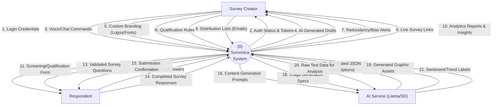
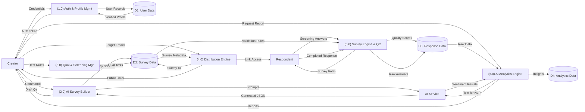

# Survonica: Data Flow Diagram (DFD) Report

This document provides a formal representation of data flow within the Survonica system at two levels of abstraction.

## 1. DFD Level 0: Context Diagram
The Context Diagram represents the entire **Survonica System** as a single process and illustrates its interactions with external entities. Each functionality is represented by a distinct data flow arrow as requested.

---

## 2. DFD Level 1: Process Decomposition
Level 1 breaks down the system into its core functional components, surfacing internal data stores and process-to-process interactions.

---

## 3. Data Flow Definitions

| ID | Data Flow | Source | Destination | Description |
| :--- | :--- | :--- | :--- | :--- |
| **1-2** | Auth Flow | Creator | P1.0 | Handles secure access and user identity setup. |
| **3-4** | Generative Flow | Creator | P2.0 | High-level commands used to drive the Llama 3.2 engine. |
| **7** | Quality Alerts | P2.0 | Creator | Proactive warnings about biased or duplicate questions. |
| **11-12** | Screening Flow | P5.0 | Respondent | Ensures respondents meet criteria before data collection. |
| **20-21** | Analytics Flow | P6.0 | AI Service | Deep analysis of natural language responses for sentiment. |

## 4. Formal DFD Rules Followed
1.  **Conservation of Data:** All processes have at least one input and one output.
2.  **No direct External Entity interactions:** All communication between Creator and Respondent passes through the system.
3.  **No direct Data Store interactions:** Data stores are only accessed/modified through a process.
4.  **Unique Flows:** Every label in Level 0 represents a distinct functional interaction, avoiding "Generic Data" labels.
