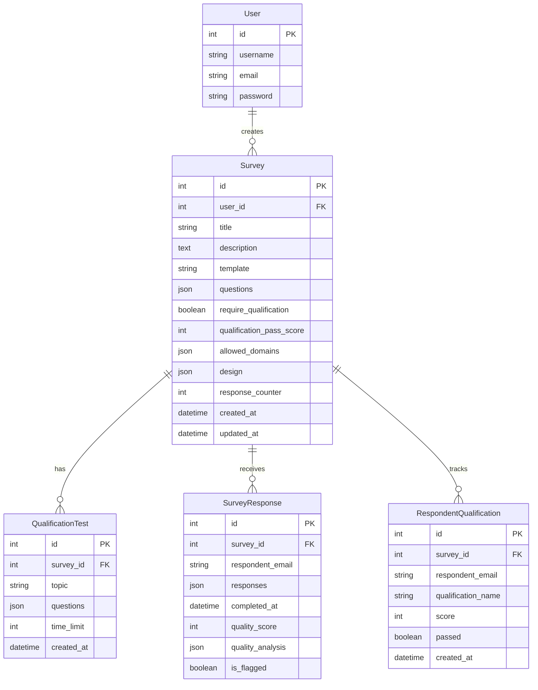

# Entity Relationship Diagram (ERD)

This diagram represents the database schema for the Survonica project, based on the Django models.

```mermaid
erDiagram
    User ||--o{ Survey : creates
    Survey ||--o{ QualificationTest : has
    Survey ||--o{ SurveyResponse : receives
    Survey ||--o{ RespondentQualification : tracks

    User {
        int id PK
        string username
        string email
        string password
    }

    Survey {
        int id PK
        int user_id FK
        string title
        text description
        string template
        json questions
        boolean require_qualification
        int qualification_pass_score
        json allowed_domains
        json design
        int response_counter
        datetime created_at
        datetime updated_at
    }

    QualificationTest {
        int id PK
        int survey_id FK
        string topic
        json questions
        int time_limit
        datetime created_at
    }

    SurveyResponse {
        int id PK
        int survey_id FK
        string respondent_email
        json responses
        datetime completed_at
        int quality_score
        json quality_analysis
        boolean is_flagged
    }

    RespondentQualification {
        int id PK
        int survey_id FK
        string respondent_email
        string qualification_name
        int score
        boolean passed
        datetime created_at
    }
```
