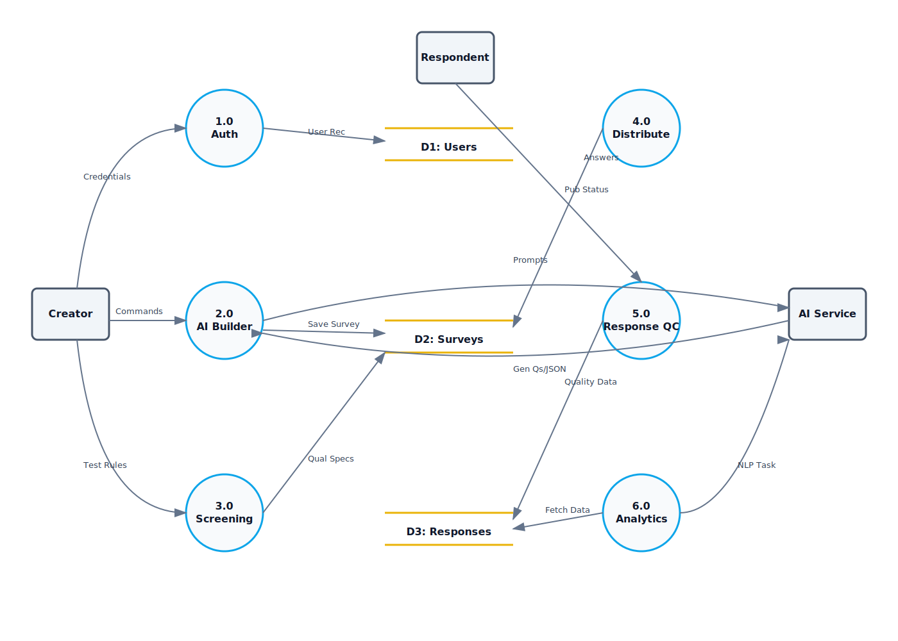
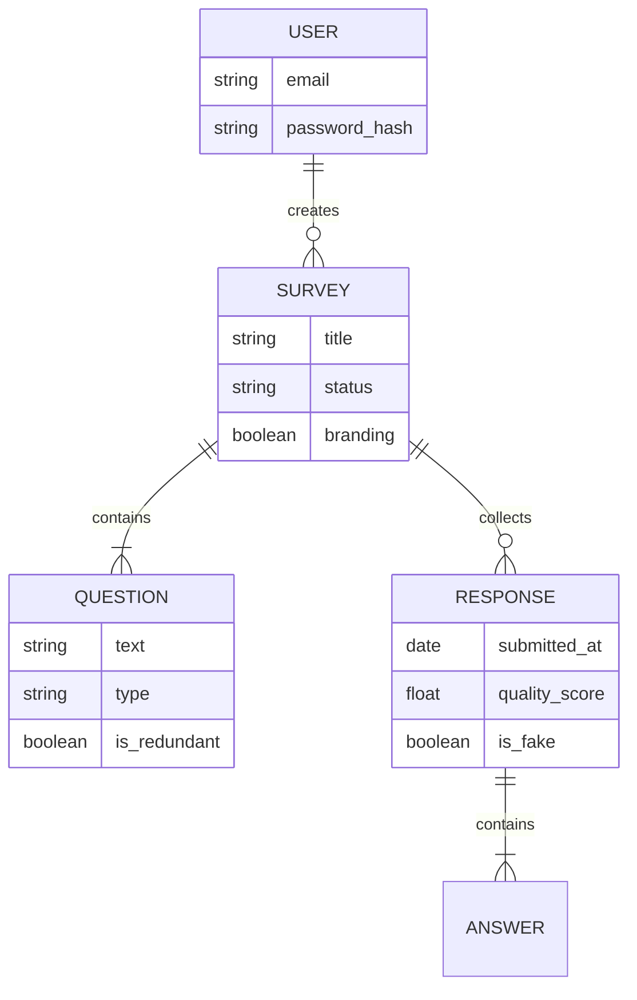
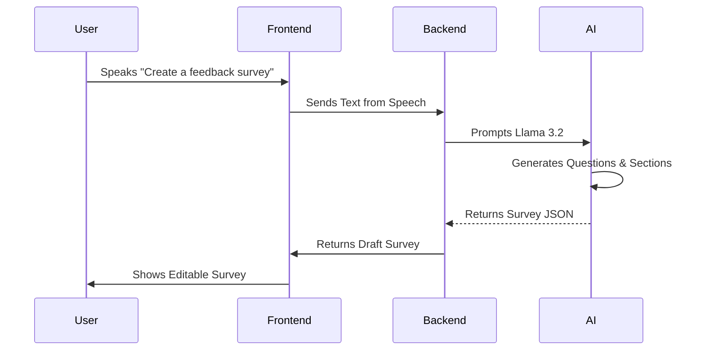
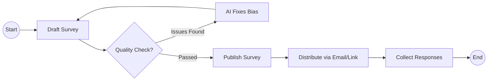

# Survonica: The Intelligent Way to Create and Distribute Surveys

**Final Year Project Report**

**Department of Computer Science**
**Namal University, Mianwali**

**2025-2026**

**Team Members:**
*   **Ahmad Mustafa** (Full Stack / AI)
*   **Abdul Qadeer** (Frontend)

**Supervisors:**
*   **Supervisor:** Dr. Ali Shahid
*   **Co-Supervisor:** Miss Sonia Safeer

*A project submitted in partial fulfilment of the requirements for the degree of Bachelor of Science in Computer Science.*

**Namal University, 30-KM, Talagang Road, Mianwali, Pakistan.**
[www.namal.edu.pk](http://www.namal.edu.pk)

---

## DECLARATION

The project report titled "**Survonica: The Intelligent Way to Create and Distribute Surveys**" is submitted in partial fulfillment of the degree of Bachelors of Science in Computer Science, to the Department of Computer Science at Namal University, Mianwali, Pakistan.

It is declared that this is an original work done by the team members listed below, under the guidance of our supervisor "**Dr. Ali Shahid**". No part of this project and its report is plagiarized from anywhere, and any help taken from previous work is cited properly. No part of the work reported here is submitted in fulfillment of requirement for any other degree/ qualification in any institute of learning.

| Team Members | Signatures |
| :--- | :--- |
| Ahmad Mustafa | ____________________ |
| Abdul Qadeer | ____________________ |

**Supervisor:** Dr. Ali Shahid
**Signatures with date:**
__________________________
__________________________

---

## Abstract

Survonica is a smart web platform that fixes the problems with old survey tools like Google Forms. Traditional tools are manual and often lead to boring or repetitive questions. Survonica uses modern AI (Llama 3.2) to help users build better surveys faster.

Our system lets you **talk to an AI** to create a survey, uses **Voice Commands** so you don't have to type, and automatically finds **duplicate questions**. It features a powerful **Analytics Dashboard** that doesn't just show charts—it reads the text responses and tells you what people actually feel (Sentiment Analysis) and gives you advice on how to improve. This project combines a modern website (React) with a smart backend (Django + AI) to make surveys easy and intelligent.

---

# Chapter 1: Introduction

Surveys are a vital tool for businesses, schools, and researchers to collect information, but the traditional process of creating them is often manual, difficult, and time-consuming. Users frequently struggle with formatting, spend hours writing questions, and inadvertently introduce errors like duplicate or confusing questions. This manual approach leads to "Survey Fatigue" and often results in low-quality data because there involves no smart system to assist the user.

To address these challenges, we chose this project to leverage modern Artificial Intelligence (AI) to automate and simplify the entire process. The main goal of **Survonica** is to build a smart web application where anyone can create a professional survey in minutes without technical skills. By replacing complex forms with an intelligent "Chatbot" and Voice Assistant, Survonica allows users to build surveys simply by talking or typing in plain English. The system acts like a smart teacher, automatically writing questions, checking for bias, and filtering out "fake" or lazy responses to ensure high-quality results.

To achieve these goals, Survonica provides a suite of powerful features. The **AI Chat Builder** and **Voice Commands** allow for hands-free, natural survey creation, while **Qualification Tests** enable users to screen respondents (e.g., "Are you over 18?") before they enter the survey. Once responses are collected, the **Advanced Analytics** engine uses AI to find sentiments and key trends in text answers, and **Quality Control** tools ensure that questions are unbiased and data is genuine.

### 1.1 Purpose
The specific purpose of this SRS document is to define the functional and non-functional requirements for **Survonica**, an AI-powered survey automation platform. In the current industrial context, organizations struggle with the manual, error-prone process of designing and auditing surveys, which leads to operational inefficiencies and data fatigue.

This document clearly outlines how Survonica aims to solve these problems by integrating Generative AI for automated survey creation and response auditing. It serves as a definitive guide for developers, stakeholders, and supervisors to understand the system's objectives: to reduce survey creation time, enhance data quality through redundancy detection, and provide actionable, automated insights for decision-making.

### 1.2 Scope
The scope of **Survonica** is to allow anyone to create professional surveys without needing technical skills. This project focuses on three main areas:

**Goals:**
*   **Efficiency (Faster Creation):** To drastically reduce the time and effort needed to design surveys. Users should be able to create a full survey in minutes using AI, rather than spending hours manually formatting questions.
*   **Data Reliability (Better Quality):** To automatically prevent common human errors like biased or duplicate questions, and to filter out fake answers so the final data is trustworthy.
*   **Accessible Intelligence (Easier Analysis):** To make advanced data analysis available to everyone. The goal is to instantly turn raw text answers into clear, actionable, and easy-to-understand reports without needing a data scientist.

**Key Functionalities:**
*   **Fully Conversational AI Assistant:** A smart, trained survey assistant that talks to you like a human. It proactive asks about demographic questions and helps organize surveys into **Sections** (multiple pages). It even **Automatically Generates Options** for your questions so you don't have to type them manually.
*   **Advanced Editable Templates:** Users can choose strict, professional templates that are editable section-by-section, allowing for precise control over the survey structure.
*   **Visual Customization (AI Images):** The system can generate pertinent **Logos** and unique images for **Page-by-Page** visualization using AI, making every survey look custom-made.
*   **Screening Tests:** It makes sure only the right people (e.g., specific age groups) answer your survey.
*   **Fake Answer Security:** It finds and removes answers that look fake or lazy.
*   **Advanced Analytics:** It automatically analyzes all text answers to uncover hidden trends and human feelings (Sentiment Analysis) that simple charts miss.

**Industrial Applications:**
This system is built for the real world. **Marketing Teams** can use it to understand what customers want. **HR Departments** can use it to anonymously check if employees are happy. **Researchers** can use it to collect clean data without spending weeks analyzing it manually.

### 1.3 Definitions, Acronyms, and Abbreviations
*   **AI (Artificial Intelligence):** Computer programs that can think and learn like humans.
*   **API (Application Programming Interface):** A bridge that allows different software (like our Frontend and Backend) to talk to each other.
*   **GDPR (General Data Protection Regulation):** International rules about protecting user privacy and data.
*   **JSON (JavaScript Object Notation):** A standard format used to send data (like questions and answers) between the server and the website.
*   **LLM (Large Language Model):** A specialized AI trained on vast amounts of text to understand and generate human language (e.g., Llama 3.2).
*   **NLP (Natural Language Processing):** Technology that helps computers understand, interpret, and manipulate human language (used for Sentiment Analysis).
*   **REST (Representational State Transfer):** The architectural style we use for our backend web services.
*   **SPA (Single Page Application):** A type of website (built with React) that loads once and feels like a fast, smooth app without reloading pages.
*   **SRS (Software Requirements Specification):** This document, which acts as the official blueprint for the software.
*   **STT (Speech-to-Text):** Technology that converts spoken words into written text (used for our Voice Assistant).

### 1.4 References
1.  [1] Meta AI, "Llama 3.2 Model Card," 2024. [Online]. Available: https://ai.meta.com/llama/
2.  [2] Django Software Foundation, "Django Documentation," 2024. [Online]. Available: https://docs.djangoproject.com/
3.  [3] IEEE, "IEEE 830-1998 Recommended Practice for Software Requirements Specifications," IEEE Standards Association.
4.  [4] Porter, S. R., et al., "Survey Fatigue and the Decline of Response Rates," *Journal of Survey Statistics*, 2004.
5.  [5] Vaswani, A., et al., "Attention Is All You Need," *Advances in Neural Information Processing Systems*, 2017.
6.  [6] Medhat, W., et al., "Sentiment Analysis Algorithms and Applications: A Survey," *Ain Shams Engineering Journal*, 2014.

### 1.5 Overview of Report Structure
This report is organized into four main chapters to help you understand the project clearly:
*   **Chapter 1 (Introduction):** You are reading this now. It explains "Why" we built this project and "What" problems it solves.
*   **Chapter 2 (System Description):** This chapter explains "How" we built it. It describes the technology (like React and Python) and the main features of the website.
*   **Chapter 3 (Analysis and Design):** This chapter goes into detail about the rules. It lists every single feature the system must have (like Voice Commands and Analytics) and shows diagrams of how data flows.
*   **Chapter 4 (Project Status):** This chapter tells you "Where" we are now. It lists what is finished and what we plan to do next.

---

# Chapter 2: System Description

The evolution of survey methodologies has shifted significantly from manual paper-based forms (Web 1.0) to digital tools like SurveyMonkey (Web 2.0). However, recent literature indicates that "Survey Fatigue" and data quality remain critical issues due to poor design [4]. 

Current academic research highlights the transformative potential of **Large Language Models (LLMs)**. The introduction of the Transformer architecture by Vaswani et al. [5] revolutionized Natural Language Processing (NLP), enabling machines to understand context and generate human-like text. Models like **Llama 3.2** [1] allow for "Generative Survey Design," where the AI acts as a domain expert to construct surveys, a capability missing in traditional tools. Furthermore, modern **Sentiment Analysis** using huge datasets provides deeper insights than lexicon-based approaches [6]. This project leverages involves these advancements to create a system that addresses the limitations of existing manual tools.

### 2.1 Overall Description
The system is designed for a broad range of users, from **Student Researchers** with limited technical skills to **HR Managers** needing quick employee feedback.
*   **User Characteristics:** Users are expected to have basic computer literacy but do not need data science expertise.
*   **Assumptions:** It is assumed users have a stable internet connection and a modern web browser.
*   **Constraints:** The system relies on the availability of the Hugging Face API for AI tasks.

### 2.2 System Environment
The project requires the following environments to function:
*   **Software Interface:** A modern web browser (Chrome, Edge, Firefox).
*   **Hardware Interface:** Any device with internet access (Laptop, Tablet).
*   **Development Environment:**
    *   **Frontend:** React (SPA) with Tailwind CSS.
    *   **Backend:** Python Django REST Framework.
    *   **AI Service:** Hosted Inference API (Llama 3.2, Stable Diffusion).
    *   **Database:** MongoDB Atlas (NoSQL).

### 2.3 Product Perspective
Survonica operates in a domain currently dominated by tools like **Google Forms** and **SurveyMonkey**.
*   **Relation to Existing Systems:** Like these tools, Survonica allows for survey creation and distribution.
*   **Gap Analysis:** Literature shows that while existing tools offer "Digital Entry," they lack "Intelligent Design." They require the user to formulate every question. Survonica fills this gap by introducing an **AI Co-pilot** that generates structure, questions, and visual assets, solving the "cold start" problem identified in recent UX research.

### 2.4 Product Features
1.  **Fully Conversational AI Assistant:** Generates survey structures, questions, and options via chat.
2.  **Advanced Editable Templates:** Professional, section-by-section editable layouts.
3.  **Visual Customization:** AI-generated logos and page-specific images.
4.  **Screening Tests:** Demographic and criteria-based respondent filtering.
5.  **Advanced Analytics:** Deep sentiment analysis and trend discovery.
6.  **Response Audit:** Automated detection of low-quality or fake data.

---

# Chapter 3: Analysis and Design

This chapter details the system's architecture and design. We utilized an **Agile Software Process Model** for development. This iterative approach allowed us to build the core survey engine first, then incrementally add advanced AI features like the Chatbot and Analytics, refining them based on constant testing and feedback.

### 3.1 Functional Requirements

**1. Authentication & User Management**
*   **FR-01:** The system shall allow users to **Sign Up and Log In** securely.
*   **FR-02:** The system shall store user sessions to keep them logged in.

**2. Smart Survey Creation**
*   **FR-03:** The system shall provide a **Voice Assistant** (Web Speech API) to create surveys by talking.
*   **FR-04:** The system shall provide a **Conversational AI Chatbot** (Llama 3.2) to generate questions, sections, and options.
*   **FR-05:** The system shall allow **Manual Creation** where users can add/edit questions and choose types (Text, Multiple Choice).
*   **FR-06:** The system shall allow **Visual Customization**, saving logos and design settings.

**3. Advanced AI Features**
*   **FR-07:** The system shall perform **Redundancy Detection** to merge duplicate questions.
*   **FR-08:** The system shall perform **Bias Detection** to ensure neutral question phrasing.
*   **FR-09:** The system shall automatically **Generate Options** for questions.

**4. Qualification and Screening**
*   **FR-10:** The system shall allow users to create **Qualification Tests** to screen respondents.
*   **FR-11:** The system shall allow **Domain Restriction** (e.g., only allow emails from `@namal.edu.pk`).

**5. Distribution**
*   **FR-12:** The system shall generate unique **Public Links** for survey distribution.
*   **FR-13:** The system shall allow sending surveys via **Email**.

**6. Response Collection & Audit**
*   **FR-14:** The system shall collect and store responses in **MongoDB**.
*   **FR-15:** The system shall perform **Response Auditing**, calculating a "Quality Score" (0-100) for every answer to detect fakes.

**7. Analytics & Insights**
*   **FR-16:** The system shall display a real-time **Dashboard** with response counts, completion rates, and average time.
*   **FR-17:** The system shall perform **Sentiment Analysis** on open-text responses, classifying them as Positive, Neutral, or Negative.
*   **FR-18:** The system shall generate an **Executive Summary** that provides a high-level text overview of the entire survey results.
*   **FR-19:** The system shall extract **Key Insights** and **Hidden Trends** from the data automatically.
*   **FR-20:** The system shall provide **Improvement Suggestions** to help users act on the negative feedback received.

### 3.2 Non-Functional Requirements
1.  **Performance:** 
    *   **Response Time:** The system shall ensure page load times are **< 1 second** for 95% of requests.
    *   **API Latency:** AI generation requests shall be processed within **5 seconds** on average.
2.  **Scalability:** 
    *   **Concurrency:** The database shall support up to **10,000 concurrent users** without degradation.
    *   **Volume:** The system shall be capable of storing over **1,000,000 survey responses**.
3.  **Security:** 
    *   **Encryption:** Data at rest shall be encrypted using **AES-256**.
    *   **Transmission:** All data in transit shall use **TLS 1.3** via HTTPS.
    *   **Authentication:** Password hashing shall use **bcrypt** with a work factor of 12.
4.  **Reliability:** 
    *   **Availability:** The system shall maintain **99.9% uptime** during business hours.
    *   **Data Integrity:** The system shall have a **Recovery Point Objective (RPO)** of < 15 minutes.
5.  **Maintainability:** 
    *   **Code Coverage:** The backend test suite shall maintain **> 80% code coverage**.
    *   **Modularity:** The system shall use a decoupled architecture (Frontend/Backend) to allow independent updates.

### 3.3 System Models

#### 3.3.1 DFD Level 0 (Context Diagram)
**Description:** High-level system overview showing interactions between the Creator, Respondent, and AI Service with functionality-specific data flows.


#### 3.3.2 DFD Level 1
**Description:** Detailed process flow highlighting system decomposition, data stores (User, Survey, Response, Analytics), and process interactions.



#### 3.3.3 Use Case Diagram
```mermaid
usecaseDiagram
    actor "User" as U
    actor "AI System" as AI

    package "Survonica System" {
        usecase "Login / Signup" as UC1
        usecase "Create via Chat/Voice" as UC2
        usecase "Edit Survey" as UC3
        usecase "Distribute Survey" as UC4
        usecase "View AI Analytics" as UC5
    }

    U --> UC1
    U --> UC2
    U --> UC3
    U --> UC4
    U --> UC5

    UC2 -.-> AI : Include
    UC5 -.-> AI : Include
```

#### 3.3.3 Entity Relationship Diagram (ERD)


#### 3.3.4 Sequence Diagram (Survey Creation)


#### 3.3.5 Activity Diagram (Distribution Flow)


### 3.4 External Interface Requirements
#### 3.4.1 User Interfaces
The system uses a **Single Page Application (SPA)** interface built with **React**. It features a "Dark Mode" aesthetic with "Glassmorphism" effects for a modern feel. The layout is responsive, adapting to both desktop and tablet screens.

#### 3.4.2 Hardware Interfaces
*   **Client:** Any internet-enabled device with a screen and optional microphone for Voice commands.
*   **Server:** Cloud-based Virtual Machine (hosting Django) with access to high-performance GPUs (via Hugging Face API) for AI inference.

#### 3.4.3 Software Interfaces
*   **Django REST Framework:** For handling API requests.
*   **MongoDB Atlas:** For NoSQL data storage.
*   **Hugging Face Inference API:** For accessing Large Language Models.

#### 3.4.4 Communication Interfaces
*   **HTTPS:** All data transfer occurs over secure HTTP channels.
*   **JSON:** The standard data format for all API communication.

### 3.5 Constraints and Limitations
*   **API Usage Limits:** Heavy reliance on external AI APIs means we are subject to their rate limits and potential costs.
*   **Internet Dependency:** The system requires an active internet connection; there is no offline mode.

### 3.6 Assumptions and Dependencies
*   **Assumption:** Users will speak clearly when using Voice commands.
*   **Assumption:** Browser supports modern Web Speech API.
*   **Dependency:** Continuous availability of the Hugging Face Inference API.

---

# Chapter 4: Semester 8 Workplan

This chapter outlines the remaining tasks for the final semester, focusing on testing, deployment, and final documentation.

### 4.1 System Testing Phase (Weeks 1-4)
*   **Unit Testing:** Implement automated tests for Django views using `pytest` to achieve >80% coverage.
*   **Integration Testing:** Verify seamless data flow between React Frontend, Django Backend, and AI APIs.
*   **User Acceptance Testing (UAT):** Conduct trials with a sample group of 20 students to validate usability.
*   **Performance Testing:** Simulate 500+ concurrent users to test database load balancing.

### 4.2 Deployment Phase (Weeks 5-8)
*   **Frontend Deployment:** Deploy the React application to **Vercel** for global CDN distribution.
*   **Backend Deployment:** Host the Django API on **AWS EC2** or **Heroku** with production-grade Gunicorn server.
*   **Database Migration:** Migrate local MongoDB data to **MongoDB Atlas (Production Cluster)**.
*   **Domain Setup:** Configure SSL certificates and custom domain routing.

### 4.3 Documentation & Finalizing (Weeks 9-12)
*   **User Manual:** Create a comprehensive guide with screenshots for end-users.
*   **Technical Documentation:** Finalize API documentation (Swagger/OpenAPI).
*   **Final Report:** Complete the Final Year Project thesis formatting.
*   **Defense Preparation:** Prepare presentation slides and live demo script for the final evaluation.

---

# References

1.  **Llama 3.2:** Developed by Meta AI for advanced language understanding.
2.  **Stable Diffusion:** Used for generating high-quality images.
3.  **React & Django:** The industry-standard tools we used to build the application.
