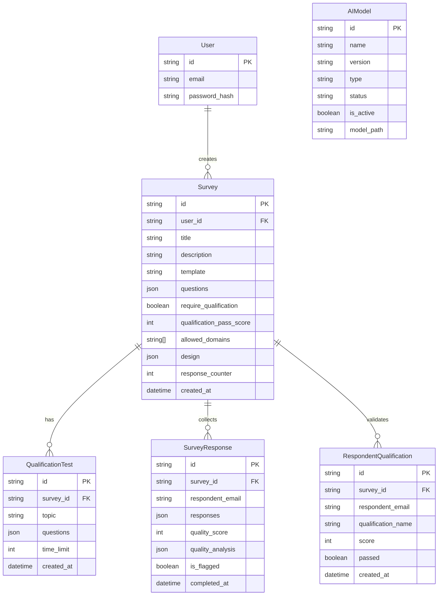

# Survonica: Entity Relationship Diagram (ERD)

This document describes the database schema and relationships for the Survonica system using Mermaid.

## Mermaid ER Diagram

## Entity Descriptions

1. **User**: Represents the survey creator. (Managed via Authentication Service).
2. **Survey**: The core entity storing survey structure, settings, and questions.
3. **QualificationTest**: Optional pre-screening test attached to a survey.
4. **SurveyResponse**: Stores the actual answers provided by a respondent, including quality metrics.
5. **RespondentQualification**: records the result of a respondent taking a qualification test.
6. **AIModel**: Metadata about local AI models used for quality/sentiment analysis.
